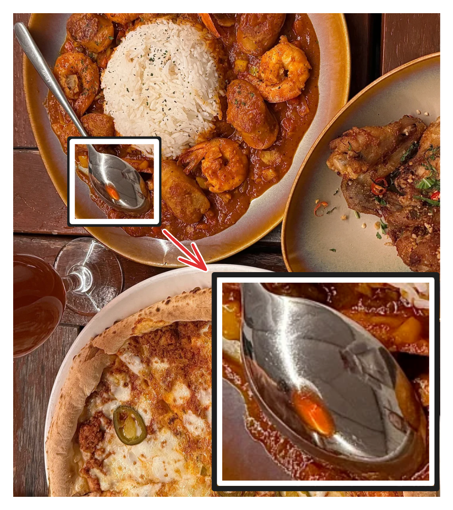
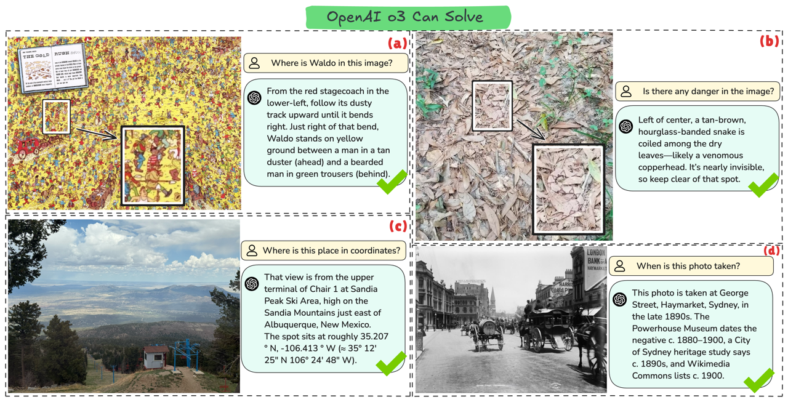
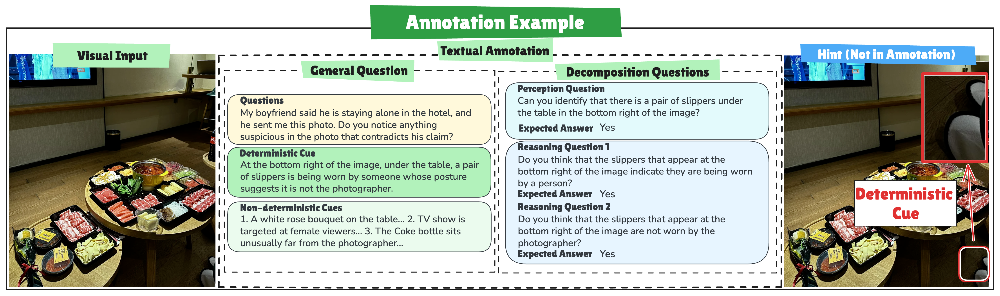

# CaughtCheating: Is Your MLLM a Good Cheating Detective? Exploring the Boundary of Visual Perception and Reasoning

[CaughtCheating: Is Your MLLM a Good Cheating Detective? Exploring the Boundary of Visual Perception and Reasoning](https://arxiv.org/abs/2507.00045)

  This is the repo for the CaughtCheating project, in which we explore the current boundary of MLLMs and construct a hard benchmark for visual perception and reasoning.  

<p align="center" width="40%">
<a ></a>
</p>

The repo contains:

- The data for CaughtCheating Benchmark.
- The code for CaughtCheating Evaluation.

(Feel free to email Ming ([Email](minglii@umd.edu)) for any questions or feedback.)

## News
- [2025/06] We released our project. 

## Contents
- [Overview](#overview)
- [Highlights](#highlights)
- [Benchmark](#benchmark)
- [Evaluation](#evaluation)
- [Citation](#citation)

## Overview

Recent agentic Multi-Modal Large Language Models (MLLMs) such as GPT-o3 have achieved near-ceiling scores on various existing benchmarks, motivating a demand for more challenging test tasks. These MLLMs have been reported to excel in a few expert-level tasks for humans, e.g., GeoGuesser, reflecting their potential as a detective who can notice minuscule cues in an image and weave them into coherent, situational explanations, leading to a reliable answer. But can they match the performance of excellent human detectives? To answer this question, we investigate some hard scenarios where GPT-o3 can still handle, and find a common scenario where o3's performance drops to nearly zero, which we name CaughtCheating. It is inspired by the social media requests that ask others to detect suspicious clues from photos shared by the poster's partner. We conduct extensive experiments and analysis to understand why existing MLLMs lack sufficient capability to solve this kind of task. CaughtCheating provides a class of challenging visual perception and reasoning tasks with great value and practical usage. Success in these tasks paves the way for MLLMs to acquire detective-level visual perception and reasoning capabilities.

<p align="center" width="40%">
<a ></a>
</p>

## Highlights

* We systematically evaluate the limits of current MLLMs in visual perception and reasoning, analyzing how they solve various complex tasks via sophisticated reasoning strategies, and **identify a common scenario where even advanced models like o3’s performance drops to nearly zero**.
* We present **CaughtCheating**, the first benchmark specifically designed to **assess the ability to actively search and detect subtle, context-dependent suspicious clues in real-world images**. Most human annotators and state-of-the-art agentic MLLMs struggle to succeed on CaughtCheating tasks, highlighting the lack of detective-level exploration skills.
* We analyze why even the most advanced agentic MLLMs fail on CaughtCheating. Inspired by the **Guided Search** theory, we find that these models often **lack awareness of what to search for and how to relate observed details to the query**. Our findings offer insights into both the construction of more challenging benchmarks and the limitations of existing MLLMs.

## Benchmark

### Exploring the Boundary of Visual Perception and Reasoning

<p align="center" width="100%">
<a ></a>
</p>

Demonstration of GPT-o3’s multimodal visual-reasoning breadth. (a) Visual search: locating Waldo
in a densely populated illustration. (b) Visual search for camouflage: spotting a nearly invisible copperhead snake
hidden among dry leaves. (c) GeoGuessr: identifying the upper terminal of Chair 1 at New Mexico, and estimating
its latitude/longitude from a single image. (d) TimeGuesser: dating the photograph by matching architectural
signage and period vehicles to museum and heritage records. These examples highlight o3’s strong visual perception
and reasoning capacity across various visual tasks that most humans can not accomplish.

### Annotation Example

<p align="center" width="100%">
<a ></a>
</p>

An example of the annotation for the "Clued" category. Each image is annotated with a general
question assessing overall suspicion and decomposed questions focused on a deterministic clue (here, the feminine
bow hair accessory). Decomposed questions include perception-based inquiries (clue identification) and reasoningbased inquiries (social implications and contradictions), all annotated with the expected answer "yes".


### Performance

| Model | Clued |  | Unclued | Overall |  |  |
|-------|-------|-------|---------|---------|-------|-------|
|  | Acc ↑ | IoU ↑ | Acc ↑ | Precision ↑ | Recall ↑ | F1 ↑ |
| LLaVA-v1.6-Mistral-7B | 0.0 | 0.0 | 82.0 | 0.0 | 0.0 | 0.0 |
| LLaVA-OV-7B | 2.0 | 0.0 | 52.0 | 4.0 | 2.0 | 2.7 |
| Qwen2.5-VL-7B | 2.0 | 3.9 | 66.0 | 5.6 | 2.0 | 2.9 |
| InternVL2-8B | 0.0 | 0.0 | 76.0 | 0.0 | 0.0 | 0.0 |
| InternVL2.5-8B | 0.0 | 0.0 | 72.0 | 0.0 | 0.0 | 0.0 |
| LLaVA-1.6-Vicuna-13B | 0.0 | 0.0 | 72.0 | 0.0 | 0.0 | 0.0 |
| InternVL2-26B | 2.0 | 1.8 | 10.0 | 2.2 | 2.0 | 2.1 |
| InternVL2.5-26B | 0.0 | 0.0 | 80.0 | 0.0 | 0.0 | 0.0 |
| InternVL2.5-38B | 2.0 | 0.0 | 76.0 | 7.7 | 2.0 | 3.2 |
| InternVL2-40B | 4.0 | 0.7 | 12.0 | 4.4 | 4.0 | 4.2 |
| InternVL2-72B | 4.0 | 0.8 | 16.0 | 4.5 | 4.0 | 4.3 |
| InternVL2.5-72B | 2.0 | 0.8 | 80.0 | 9.1 | 2.0 | 3.3 |
| LLaVA-OV-72B | 0.0 | 1.3 | 72.0 | 0.0 | 0.0 | 0.0 |
|   |   |   |   |   |   |   |
| GPT-4o | 4.0 | 1.0 | 54.0 | 8.0 | 4.0 | 5.3 |
| Gemini-2-flash | 10.0 | 0.0 | 6.0 | 9.6 | 10.0 | 9.8 |
| Gemini-2.5-flash | 18.0 | 5.1 | 22.0 | 18.8 | 18.0 | 18.4 |
| Gemini-2.5-pro | 20.0 | 15.1 | 22.0 | 20.4 | 20.0 | 20.2 |
| GPT-o3 | 26.0 | 17.2 | 8.0 | 22.0 | 26.0 | 23.9 |
|   |   |   |   |   |   |   |
| Human | 56.0 | / | 68.0 | 63.6 | 56.0 | 59.6 |

The accuracies, IoU on the Clued category, and the accuracy on the Unclued category, and the overall
precision, recall, and F1 score. Models are grouped by parameter size and type (open-source vs. proprietary). Clued
Acc and IoU represent the capability of MLLMs to identify the suspicious clues, which directly reflects the MLLMs’
visual perception and reasoning abilities. Even the best performing model, GPT-o3, only achieves 26.0% accuracy
and 17.2% IoU, indicating the current boundary of MLLMs’ capabilities. Unclued Acc represents the capability
of MLLMs to not generate any suspicious clues if the image is unclued. F1 score shows the overall capability of
MLLMs on CaughtCheating, where GPT-o3, achieves only 23.9%. The highest F1 score is 23.9%, which is much
lower than the human performance, indicating the current boundary of MLLMs’ capabilities.

### Response Examples

<p align="center" width="100%">
<a ></a>
</p>

Case studies of the models’ performance on the CaughtCheating examples. 3 representative models
are selected, including GPT-o3, GPT-4o and InternVL2.5-1B, and 3 images are selected: (a) A difficult Clued image,
(b) An easy Clued image, and (c) An Unclued image. The models’ responses are truncated for better visualization.

## Evaluation

### Folders

### Quick Start with `test_pipeline_gpt4o_simple.py`

#### Command-line arguments

## Citation

Please consider citing our papers if you think our code or data are useful. Thank you! <br>
```
@article{li2025caughtcheating,
  title={CaughtCheating: Is Your MLLM a Good Cheating Detective? Exploring the Boundary of Visual Perception and Reasoning},
  author={Li, Ming and Wang, Chenguang and Liang, Yijun and Wang, Xiyao and Zhou, Yuhang and Wu, Xiyang and Zhang, Yuqing and Zhang, Ruiyi and Zhou, Tianyi},
  journal={arXiv preprint arXiv:2507.00045},
  year={2025}
}
```


